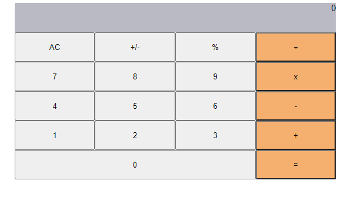

# Math-Magician
> This is the project of Calculator Application where I have used React and it's necessary tools.

## Built With

- HTML, CSS, js, React
- Linters, Markdown
- GitHub Flow, GitHub Action

 ## Getting Started

To get a local copy up and running follow these simple example steps.

1) Enter `git@github.com:basnetlaxmi/math-magician.git` into terminal

2) cd math-magician directory
3) npm start
4) View in the browser

### Prerequisites

- Code editor

- Git and Github

## Author

👤 **Laxmi Basnet**

- GitHub: [@basnetlaxmi](https://github.com/basnetlaxmi)
- LinkedIn: [LinkedIn](https://np.linkedin.com/in/laxmi-basnet-b22403131)

## 🤝 Contributing

Contributions, issues, and feature requests are welcome!

Feel free to check the [issues page](../../issues/).

## Show your support

Give a ⭐️ if you like this project!

## Acknowledgments

- Designed by [Cindy-Shin](https://www.behance.net/gallery/29845175/CC-Global-Summit-2015)
- Microverse learning partners
- Microverse

## 📝 License

This project is [MIT](./MIT.md) licensed.
